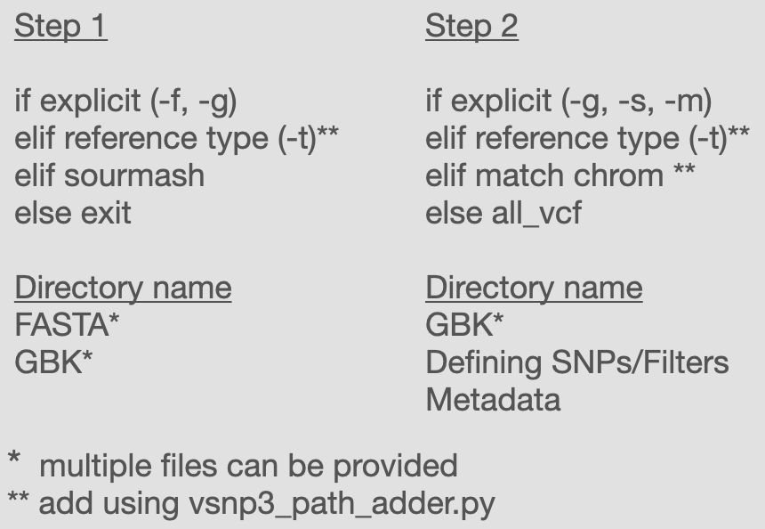
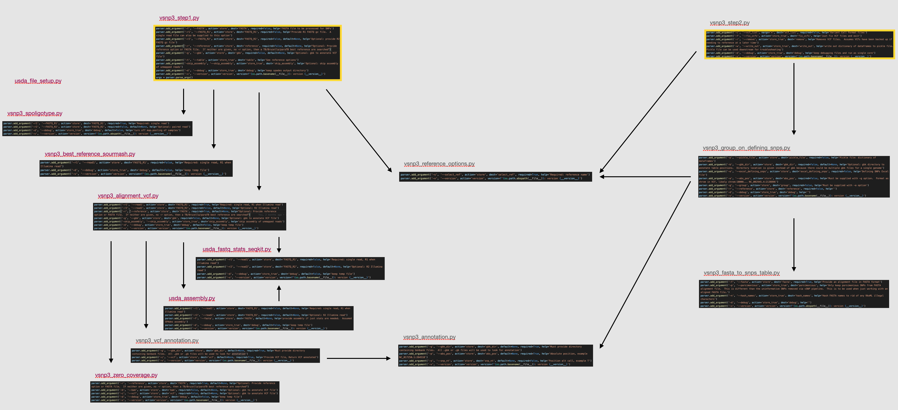

# vSNP3

This is an introduction to vSNP version 3.  A comprehensive overview of vSNP version 2 is [here](https://github.com/USDA-VS/vSNP/blob/master/docs/detailed_usage.md) with version 2 GitHub repo [here](https://github.com/USDA-VS/vSNP).

vSNP3 generates BAM, VCF and annotated SNP tables and corresponding phylogenetic trees to achieve a high resolution SNP analysis.

Whole genome sequencing for disease tracing and outbreak investigations is routinely required for high consequence diseases.  vSNP is an accreditation-friendly and robust tool, designed for easy error correction and SNP <ins>v</ins>alidation... vSNP. vSNP generates annotated SNP tables and corresponding phylogenetic trees that can be scaled for reporting purposes.   It is able to process large scale datasets, and can accommodate multiple references.

## Conda installation

Tested with Python 3.8 - 3.9.

Anaconda [setup](./docs/instructions/conda_instructions.md)

```
conda create -c conda-forge -c bioconda -n vsnp3 vsnp3=3.17 
```

## Installation test
```
which vsnp3_step1.py
```
```
vsnp3_step1.py -h
```
```
vsnp3_step2.py -h
```

## Test workflow

Download test files
```
cd ~; git clone https://github.com/USDA-VS/vsnp3_test_dataset.git
```

Add reference:
```
cd ~/vsnp3_test_dataset/vsnp_dependencies
```
```
vsnp3_path_adder.py -d `pwd`
```

## Run test with AF2122 (Mycobacterium bovis)

Test step 1:
```
cd ~/vsnp3_test_dataset/AF2122_test_files/step1
```
```
vsnp3_step1.py -r1 *_R1*.fastq.gz -r2 *_R2*.fastq.gz -t Mycobacterium_AF2122
```

Test step 2:
```
cd ~/vsnp3_test_dataset/AF2122_test_files/step2
```
```
vsnp3_step2.py -wd . -a -t Mycobacterium_AF2122
```

## Run test with NC_045512 (SARS-CoV-2)

Test step 1:
```
cd ~/vsnp3_test_dataset/NC_045512_test_files/step1
```
```
for i in *.fastq.gz; do n=`echo $i | sed 's/[_.].*//'`; echo "$i in directory $n"; mkdir -p $n; mv $i $n/; done
```
```
cdir=`pwd`; for f in *; do echo $f; cd ./$f; vsnp3_step1.py -r1 *_R1*.fastq.gz -r2 *_R2*.fastq.gz -t NC_045512_wuhan-hu-1; cd $cdir; done
```
```
mkdir stats; cp **/*stats.xlsx stats; cd stats; vsnp3_excel_merge_files.py #see combined_excelworksheets-*.xlsx stat summary
```

Test step 2:
```
cd ~/vsnp3_test_dataset/NC_045512_test_files/step2
```
```
vsnp3_step2.py -a -t NC_045512_wuhan-hu-1 -remove
```

## Description

See `-h` option for detail and usage

### Step 1
- vsnp3_step1.py <u> # main entry for step 1</u>
- vsnp3_alignment_vcf.py
- vsnp3_assembly.py
- vsnp3_best_reference_sourmash.py
- vsnp3_fastq_stats_seqkit.py
- vsnp3_group_reporter.py
- vsnp3_vcf_annotation.py
- vsnp3_zero_coverage.py

### Step 2
- vsnp3_step2.py, <u># main entry for step 2</u>
- vsnp3_fasta_to_snps_table.py
- vsnp3_group_on_defining_snps.py
- vsnp3_html_step2_summary.py
- vsnp3_remove_from_analysis.py

### Step 1 and 2
- vsnp3_annotation.py
- vsnp3_file_setup.py
- vsnp3_reference_options.py

### Utility scripts
- vsnp3_path_adder.py
- vsnp3_bruc_mlst.py
- vsnp3_download_fasta_gbk_gff_by_acc.py
- vsnp3_excel_merge_files.py
- vsnp3_filter_finder.py
- vsnp3_spoligotype.py
 
## Input Summary

<!--  -->

## Map

<!--  -->


## Version Enhancements

- Python 3.9 support.
- Modularity improvements allowing for better usage of functions.
- Sourmash to select best reference.
- All dependency files can be provided as individual options, ie. file options can be explicit or based on reference directory.
- All thresholds added as options.
- FASTAs and GBKs can remain separate.
- GBK download utility script to get full versus partial file.
- Updated annotation descriptions.
- Enhanced annotation when "no annotation provided".
- Indels called as N at group SNP positions.
- VCF files in set with "wrong" chromosome will halt script.
- Defining snps and filters zipped with starting VCF files for better repeatability.
- Ability to test defining SNPs individually.
- With only a FASTA alignment a cascading SNP table can be generated.
- Version and option capturing enhancements.
- Enhanced file input options.
- Oxford Nanopore read compatible (beta).
- all_vcf named as defining SNP column label.
- Removed Picard which drops Java requirements thus providing easier conda installation.
- Strict sample/VCF file naming requirements when matching metadata names.  Using the two column metadata Excel worksheet first column must match VCF file exactly, else minus ".vcf",  else minus "_zc.vcf", else no match.
- Improved organization of cascading SNP tables.
- Unmapped reads not assembled by default.  New flag to request assembly of unmapped reads.
- Detailed steps recorded in run_log.txt.
- Spoligotype for TB complex isolates not found by default.  -s option required with step 1 or find using vsnp3_spoligotype.py.
- Brucella MLST removed from step 1.  Find Brucella MLST using vsnp3_bruc_mlst.py.

[Additional Tools](./docs/instructions/additional_tools.md)