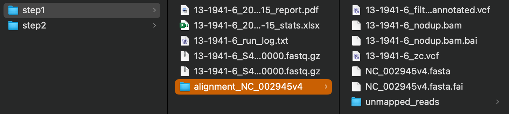
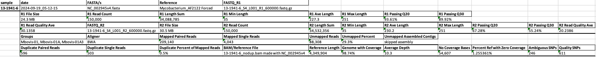
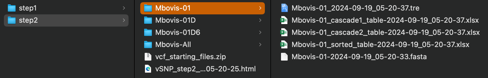
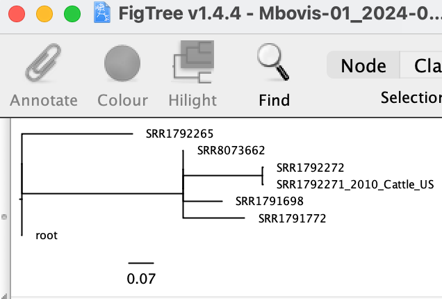
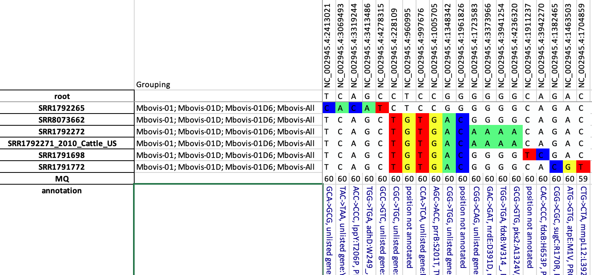

# vSNP3: Variant Calling and SNP Analysis Tool for Diagnostic Labs

vSNP3 is a robust tool for high-resolution Single Nucleotide Polymorphism (SNP) analysis tailored for diagnostic laboratories. It is designed for disease tracing and outbreak investigations. It generates BAM, VCF, and annotated SNP matrices along with corresponding phylogenetic trees. The pipeline is structured into two main steps, optimizing workflow efficiency and computational resource use.

vSNP3's two-step approach offers a powerful, flexible, and efficient solution for SNP analysis in diagnostic settings. Its ability to handle large datasets, support multiple reference genomes, and facilitate iterative analyses makes it an important tool for genomic epidemiology and pathogen surveillance.

## Pipeline Overview

### Step 1: Alignment and SNP Calling

This initial step processes raw sequencing data and produces high-quality SNP calls:

1. **Input**: Raw sequencing data (FastQ format)
2. **Alignment**: Uses tools like Samtools and Burrows-Wheeler Aligner (BWA) to map reads to a reference genome
3. **SNP Detection**: Generates Variant Call Format (VCF) files
4. **Zero Coverage Tracking**: Creates VCF files for positions lacking sequence data
5. **Output**: Individual sample directories containing:
   - Alignment data
   - VCF files
   - Sequencing quality metrics

### Step 2: SNP Matrix and Phylogenetic Tree Generation

This step combines the VCF files from Step 1 to create SNP matrices and construct phylogenetic trees:

1. **Input**: VCF files from Step 1 (all aligned to the same reference)
2. **SNP Matrix Creation**: Combines parsimonious SNPs from all samples.
3. **SNP Sorting**: Organizes SNPs by frequency or reference position
4. **Mixed SNP Handling**: Uses IUPAC ambiguity codes for positions with multiple alleles
5. **Phylogenetic Tree Construction**: Builds trees based on the SNP matrices
6. **Output**: 
   - SNP matrices with visualizations of evolutionary relationships
   - Phylogenetic trees

### Reference-Based Organization

- Each sample in Step 1 generates a separate output directory
- Directories contain all files specific to a reference (BAM, VCF, metrics)
- Ensures traceability and reproducibility of SNP calls

### Flexible Analysis

- Step 2 can be rerun independently of Step 1
- Allows easy inclusion or exclusion of samples without realignment
- Supports comparisons across multiple reference genomes

### Efficiency and Scalability

- Two-step approach optimizes resource use for large datasets
- Ideal for diagnostic workflows requiring repeated analyses
- Streamlines handling of growing sample collections over time

# Installation

```bash
conda create -c conda-forge -c bioconda -n vsnp3 vsnp3=3.26
```

If using Apple's ARM/M chip
```bash
conda create --platform osx-64 -c conda-forge -c bioconda -n vsnp3 vsnp3=3.26
```

For detailed Miniconda setup instructions, see [conda instructions](./docs/instructions/conda_instructions.md).

### Verification

To verify the installation:

```bash
which vsnp3_step1.py
vsnp3_step1.py -h
vsnp3_step2.py -h
```

## Quick Start

1. Clone the test dataset:
   ```bash
   cd ~
   git clone https://github.com/USDA-VS/vsnp3_test_dataset.git
   ```

2. Add reference:
   ```bash
   cd ~/vsnp3_test_dataset/vsnp_dependencies
   vsnp3_path_adder.py -d `pwd`
   ```

3. Run test with AF2122 (Mycobacterium bovis):
   - Step 1: <br>
    Input: FASTQ files for a single sample
     ```bash
     cd ~/vsnp3_test_dataset/AF2122_test_files/step1
     vsnp3_step1.py -r1 *_R1*.fastq.gz -r2 *_R2*.fastq.gz -t Mycobacterium_AF2122
     ```
   - Step 2: <br>
    Input: "_zc.vcf" files that have been generated from the same reference type
     ```bash
     cd ~/vsnp3_test_dataset/AF2122_test_files/step2
     vsnp3_step2.py -a -t Mycobacterium_AF2122
     ```
     **Note:** "_zc.vcf" files from step 1 are used in step 2.  These "_zc.vcf" contain positions with Zero Coverage.

4. Output:

Step 1 file structure:
    

Step 1 alignment metrics:
    
*Artifically wrapped rows*<br>
**Note:** Highlighted cells

- Sample: Name of the sample
- Reference: Reference used to align reads and call SNPs
- Groups: The groups in which the sample will be placed based on defining SNPs
- Genome with Coverage: Percentage of reference genome that has alignment coverage of sample reads
- Average Depth: The average depth of read coverage aligned to the reference
- Ambiguous SNPs: The number of SNPs called with AC=1, indicating a mixed call at a position
- Quality SNPs: The number of SNPs called with a QUAL greater than 300 and AC=2, indicating a relatively high-quality SNP
  
Step 2 file structure:
    

Step 2 tree:



Step 2 corresponding SNP matrix:



**Note:** The sample order in the tree corresponds to the sample order in the table. Additionally, for each sample, the nodes and branch lengths are relative to the SNPs in the table.

## Script detail

vSNP3 is divided into two main steps:

### Reference types

Under the Quick Start at #2, adding references was done. Reference types are added to help standardize the references used and to provide structure when adding additional information to the analysis. Although files that steps 1 and 2 rely on can be called each time the scripts are run, it is easier and more stable if they are provided by using a reference type. Each reference type includes at least 4 files:
- Defining filter Excel file: This file contains defining SNP positions. If a sample contains a defining SNP, it is placed into a group as named in the file. Because every alignment will have positions that are consistently poor, positions can be added at each group. Positions added will not be included in the analysis.  The first column of this file lists positions that will be filtered from all comparisons.
- Metadata Excel file: A two-column file that will match sample names in column one and update them to names in column two.
- FASTA: Reference used to align reads.
- GenBank: Provides annotation.

### Step 1

Main entry: `vsnp3_step1.py`

Scripts used by step 1:
- vsnp3_alignment_vcf.py
- vsnp3_assembly.py
- vsnp3_best_reference_sourmash.py
- vsnp3_fastq_stats_seqkit.py
- vsnp3_group_reporter.py
- vsnp3_vcf_annotation.py
- vsnp3_zero_coverage.py

### Step 2

Main entry: `vsnp3_step2.py`

Scripts used by step 2:
- vsnp3_fasta_to_snps_table.py
- vsnp3_group_on_defining_snps.py
- vsnp3_html_step2_summary.py
- vsnp3_remove_from_analysis.py

### Utility Scripts

- vsnp3_path_adder.py
- vsnp3_bruc_mlst.py
- vsnp3_download_fasta_gbk_gff_by_acc.py
- vsnp3_excel_merge_files.py
- vsnp3_filter_finder.py
- vsnp3_spoligotype.py

For detailed usage of each script, use the `-h` option.

## Additional Tools

For information on additional tools, see [Additional Tools](./docs/instructions/additional_tools.md).

## Archived Detail:
Archived vSNP detail is [here](https://github.com/USDA-VS/vSNP/blob/master/docs/detailed_usage.md)

##

For more information or support, please open an [issue on the GitHub](https://github.com/USDA-VS/vSNP3/issues) or [email](mailto:tod.p.stuber@usda.gov) directly.

If vSNP3 is used please [cite this article](https://bmcgenomics.biomedcentral.com/articles/10.1186/s12864-024-10437-5).
