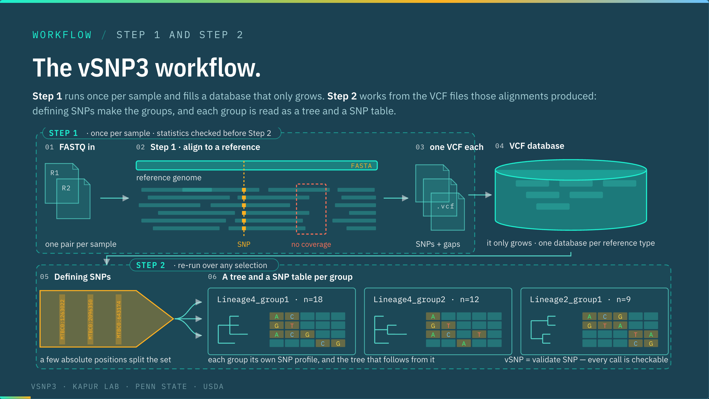
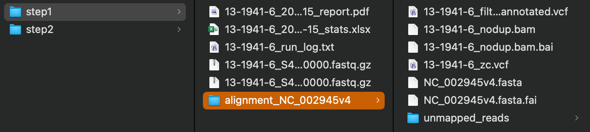
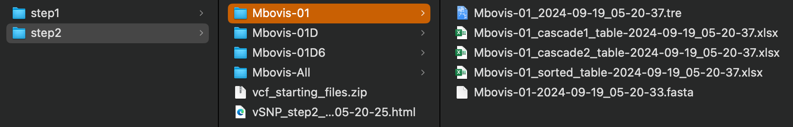
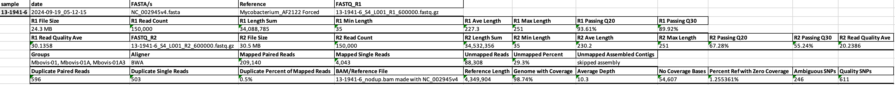
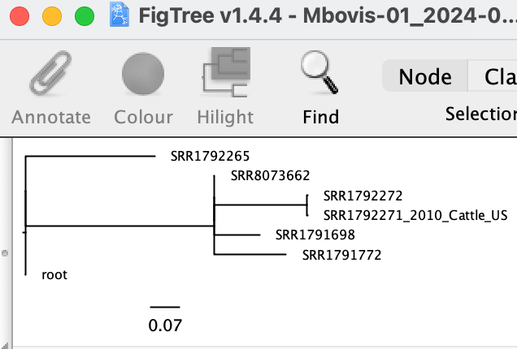
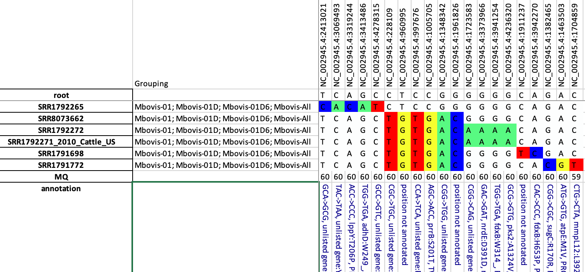
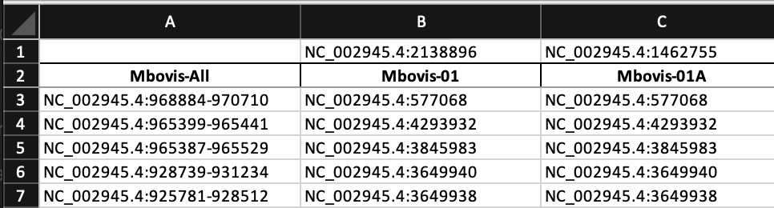

# vSNP3

[](https://github.com/USDA-VS/vSNP3/releases)
[](https://github.com/USDA-VS/vSNP3/blob/main/LICENSE)
[](https://bmcgenomics.biomedcentral.com/articles/10.1186/s12864-024-10437-5)
[](https://anaconda.org/bioconda/vsnp3)
[](https://kapurlab.github.io/bioinformatic_diagnostic_tools/vsnp3_gui_training.html#start)

vSNP3 finds SNPs in bacterial and viral genomes and builds SNP tables and phylogenetic trees from them. It was built for disease tracing and outbreak investigations in diagnostic labs.

## Two ways to run it

You can run vSNP3 from your web browser using the vSNP3 GUI, or from the command line. Both run the same analysis and give the same results.

If you're new to vSNP3, or you'd rather not work in a terminal, start with the GUI. It comes with a step-by-step training guide that takes you from install to a finished tree. If you're running vSNP3 on a cluster or as part of a pipeline, go to [Installation](#installation).

---

## vSNP3 GUI

[Get the GUI here](https://github.com/kapurlab/bioinformatic_diagnostic_tools).

There is a training guide (SOP) that uses the GUI linked above to walk through the installation process, and uses a test dataset to show how vSNP works.

| | |
|---|---|
| **Time** | About 3 hours the first time. Most of that is waiting for downloads and runs. Slow internet makes it longer. |
| **You need** | A Mac, Linux, or Windows computer, internet, and about 50 GB of free disk space. |
| **Tested** | 1 October 2026, vSNP GUI v0.4.127, vsnp3 3.36. Newer versions may look a little different. |

**[Start the training guide →](https://kapurlab.github.io/bioinformatic_diagnostic_tools/vsnp3_gui_training.html#start)**

### What the GUI handles for you

- Installing on macOS, Linux, or Windows, with every command written out
- A dashboard for checking, updating, and restarting the tools
- Downloading reads from SRA: paste the accession numbers and it fetches them
- A quality check after Step 1 that flags any sample worth a second look
- Adding sample names, so trees show where samples came from instead of just SRR numbers
- A tree viewer where you can search for samples and open the SNP table for any clade

For GUI questions or bugs, use the [bioinformatic_diagnostic_tools issue tracker](https://github.com/kapurlab/bioinformatic_diagnostic_tools/issues).

---

## What vSNP3 does well

- Calls SNPs at single-nucleotide resolution, and every call can be checked
- Lets you add new samples without rerunning the old ones
- Sorts samples into groups automatically using defining SNPs
- Lets you compare just the samples you care about, which saves time
- Produces BAM and VCF files, annotated SNP tables, and phylogenetic trees
- Tracks positions with no coverage, so missing data isn't mistaken for a match
- Marks mixed positions with IUPAC codes, which helps you spot mixed strains

## How it works



vSNP3 runs in two steps.

**Step 1** runs once per sample. It aligns the reads to a reference genome and calls SNPs, which gives you a VCF file. That VCF goes into your database and stays there.

**Step 2** takes any set of VCFs from your database and builds SNP tables and trees.

This split is the main idea behind vSNP3. With many SNP pipelines, adding new samples means rerunning everything. With vSNP3, you run Step 1 on just the new samples, then rerun Step 2. You can also run Step 2 on different sets of samples for different investigations.

<p align="center">
  
</p>
<p align="center">
  
</p>

### Step 1: alignment and SNP calling

For each sample, Step 1:

- aligns reads to your reference genome
- calls high-quality SNPs
- tracks regions with zero coverage
- reports quality metrics
- assigns the sample to a group based on defining SNPs

Here's what the quality metrics look like:



### Step 2: SNP tables and trees

Step 2 combines results from any set of samples you've run through Step 1. It:

- builds SNP tables
- builds phylogenetic trees
- shows mixed positions using IUPAC codes
- writes an HTML summary report, with a PDF of each

Example output:

<p align="center">
  
  
</p>

## An example

Say you're following an outbreak over time. You run your first 10 samples through Step 1, then run Step 2 to get a tree. A month later, 5 more samples come in. You run Step 1 on only those 5, then run Step 2 on all 15 to see where the new ones fit. If one cluster stands out, you can run Step 2 on just that group for a closer look.

The [GUI training](https://kapurlab.github.io/bioinformatic_diagnostic_tools/vsnp3_gui_training.html#start) works the same way with real data. 21 known samples make up the database, and you figure out where two new outbreaks came from.

## Defining SNPs

A defining SNP is a position that splits samples into groups. If a sample has a T at a certain position, it goes in Group A, and if it has a C, it goes in Group B. Other positions split those groups again.

```
Full Dataset (100 samples)
   │
   ├── Group A (40 samples) - Defining SNP: position 123456 = T
   │    │
   │    ├── Subgroup A1 (15 samples) - Defining SNP: position 234567 = G
   │    │
   │    └── Subgroup A2 (25 samples) - Defining SNP: position 234567 = A
   │
   └── Group B (60 samples) - Defining SNP: position 123456 = C
        │
        ├── Subgroup B1 (20 samples) - Defining SNP: position 345678 = T
        │
        └── Subgroup B2 (40 samples) - Defining SNP: position 345678 = C
```

vSNP3 checks every sample at these positions during Step 1 and assigns its group. That keeps a large database organized, and it means you can run Step 2 on one group instead of everything.

### The defining SNP file

Each reference type has an Excel file that lists its defining SNPs. To find yours:

```bash
vsnp3_path_adder.py -s
```

This lists your installed reference types and the paths to their files.

<p align="center">
  
</p>

The file is laid out like this:

1. **Row 1** lists the defining positions, as chromosome:position.
2. **Row 2** names the group each position defines, such as Mbovis-All, Mbovis-01, or Mbovis-01A.
3. **The rows below** list positions to filter out when analyzing that group.

Some positions give unreliable calls in certain lineages. Listing them under a group keeps them out of that group's analysis.

You can edit this file as you learn more, adding groups for new lineages or new positions to filter. Keep a backup, since it holds a lot of work.

---

## Installation

If you're using the GUI, the [training guide](https://kapurlab.github.io/bioinformatic_diagnostic_tools/vsnp3_gui_training.html#start) covers installation, so you can skip this section. If you're running from the terminal, follow the steps below:

```bash
conda create -c conda-forge -c bioconda -n vsnp3 vsnp3=3.36
conda activate vsnp3
```

For more detail, see the [conda instructions](./docs/instructions/conda_instructions.md).

## Quick start

Check the install:

```bash
vsnp3_step1.py -h
vsnp3_step2.py -h
```

Download the test dataset and add its reference types:

```bash
cd ${HOME}
git clone https://github.com/USDA-VS/vsnp3_test_dataset.git
cd vsnp3_test_dataset/vsnp_dependencies
vsnp3_path_adder.py -d $(pwd)
```

Run Step 1 on a sample. You only need to do this once per sample.

```bash
cd ~/vsnp3_test_dataset/AF2122_test_files/step1
vsnp3_step1.py -r1 *_R1*.fastq.gz -r2 *_R2*.fastq.gz -t Mycobacterium_AF2122
```

Run Step 2 to build the SNP table and tree. You can run this on any set of samples.

```bash
cd ~/vsnp3_test_dataset/AF2122_test_files/step2
vsnp3_step2.py -a -t Mycobacterium_AF2122
```

## Setting up reference types

A reference type is the set of files vSNP3 needs for one organism:

- a reference genome (FASTA)
- a GenBank file for annotation
- the defining SNP file (Excel)
- a metadata file that maps sample IDs to readable names (Excel)

You only set these up once. Put each reference type in its own folder inside a parent folder. The folder name becomes the reference type name you use in commands.

```
Parent_Directory/
   └── Mycobacterium_AF2122/
       ├── defining_filter.xlsx    # defining SNPs and filter positions
       ├── metadata.xlsx           # sample name mapping
       ├── AF2122.fasta            # reference genome
       └── AF2122.gbk              # GenBank annotation
```

Point vSNP3 at the parent folder, then check that it worked:

```bash
vsnp3_path_adder.py -d /path/to/Parent_Directory
vsnp3_path_adder.py -s
```

You should see your reference type listed with the paths to its files. A parent folder can hold as many reference types as you like, and you can add more parent folders by running `vsnp3_path_adder.py -d` again.

A few tips:

- Keep one folder per organism.
- Use folder names that say what the organism is.
- Use the same reference across related analyses.
- Back up your defining SNP files.

## Other tools

vSNP3 also comes with scripts for:

- adding reference paths
- MLST typing
- downloading reference genomes
- filter optimization
- spoligotyping

See [Additional Tools](./docs/instructions/additional_tools.md) for details.

## What people use it for

- Tracing transmission during outbreaks
- Surveillance and tracking how a pathogen changes over time
- Checking for drift from vaccine strains
- Spotting mixed strains
- Linking antimicrobial resistance to genetic markers

## Support and citation

For help with vSNP3, open an [issue on GitHub](https://github.com/USDA-VS/vSNP3/issues) or [email me](mailto:tod.p.stuber@usda.gov). For help with the GUI, open an issue on [bioinformatic_diagnostic_tools](https://github.com/kapurlab/bioinformatic_diagnostic_tools/issues).

If you use vSNP3 in your work, please [cite the paper](https://bmcgenomics.biomedcentral.com/articles/10.1186/s12864-024-10437-5):

> Hicks J, et al. vSNP: a SNP pipeline for the generation of transparent SNP matrices and phylogenetic trees from whole genome sequencing data sets. *BMC Genomics*. 2024;25:545.

## More reading

- [vSNP3 GUI training guide (SOP)](https://kapurlab.github.io/bioinformatic_diagnostic_tools/vsnp3_gui_training.html#start)
- [vSNP3 orientation slides](https://kapurlab.github.io/bioinformatic_diagnostic_tools/vsnp3_orientation_slides.html)
- [Documentation from earlier versions](https://github.com/USDA-VS/vSNP/blob/master/docs/detailed_usage.md)
