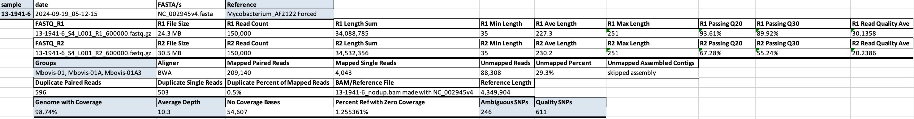

# vSNP3: High-Resolution SNP Analysis for Pathogen Surveillance

[](https://github.com/USDA-VS/vSNP3/releases)
[](https://github.com/USDA-VS/vSNP3/blob/main/LICENSE)
[](https://bmcgenomics.biomedcentral.com/articles/10.1186/s12864-024-10437-5)
[](https://anaconda.org/bioconda/vsnp3)

**vSNP3** is a powerful tool for high-resolution bacterial and viral SNP analysis, designed specifically for disease tracing and outbreak investigations in diagnostic laboratories.

<!-- <p align="center">
  
</p> -->

## 🌟 Why Choose vSNP3?

- **Superior Resolution**: Precisely identifies with confidence strain differences down to the single nucleotide level
- **Flexible Database**: Build, maintain, and update your strain database without rerunning all samples
- **Intelligent Sample Classification**: Automatically group samples based on defining SNPs
- **Computational Efficiency**: Focus analysis on relevant sample subsets, saving time and resources
- **Comprehensive Output**: Complete suite of BAM, VCF, annotated SNP matrices, and phylogenetic trees
- **Zero Coverage Tracking**: Unique capability to track regions with no sequence data
- **Mixed SNP Handling**: Accurately represents positions with multiple alleles using IUPAC codes - ability to identify mixed strains

## 🔍 The vSNP3 Advantage: Two-Step Process Explained

### Why Two Steps Are Better Than One

Most SNP callers force you to reprocess all your samples each time you add new ones. vSNP3's two-step approach is different:

1. **Step 1: Process Once** - Align reads and call SNPs for each sample individually
2. **Step 2: Combine as Needed** - Generate matrices and trees from any combination of samples

<p align="center">
  
  
</p>

This approach lets you:
- Add new samples to your analysis without reprocessing existing ones
- Create different sample groupings for different investigations
- Save computational resources and time
- Maintain a growing, curated database of SNP profiles

### Defining SNPs: Intelligent Sample Classification

A unique feature of vSNP3 is its use of defining SNPs to automatically categorize samples:

```
Full Dataset (100 samples)
   │
   ├── Group A (40 samples) - Defining SNP: position 123456 = T
   │    │
   │    ├── Subgroup A1 (15 samples) - Defining SNP: position 234567 = G
   │    │
   │    └── Subgroup A2 (25 samples) - Defining SNP: position 234567 = A
   │
   └── Group B (60 samples) - Defining SNP: position 123456 = C
        │
        ├── Subgroup B1 (20 samples) - Defining SNP: position 345678 = T
        │
        └── Subgroup B2 (40 samples) - Defining SNP: position 345678 = C
```

Benefits of defining SNPs:
- **Automatic Grouping**: Samples are classified into groups based on specific SNP patterns
- **Focused Analysis**: Quickly drill down to specific subsets of related samples
- **Hierarchical Investigation**: Filter your dataset to focus only on samples of interest
- **Computational Efficiency**: Reduce analysis time by working with smaller, relevant sample sets

## 🚀 Quick Start

```bash
# Install with conda
conda create -c conda-forge -c bioconda -n vsnp3 vsnp3=3.30
conda activate vsnp3

# Verify installation
vsnp3_step1.py -h
vsnp3_step2.py -h

# Download test dataset
git clone https://github.com/USDA-VS/vsnp3_test_dataset.git
cd vsnp3_test_dataset/vsnp_dependencies
vsnp3_path_adder.py -d $(pwd)

# Run Step 1: Process a single sample (only needed once per sample)
cd ~/vsnp3_test_dataset/AF2122_test_files/step1
vsnp3_step1.py -r1 *_R1*.fastq.gz -r2 *_R2*.fastq.gz -t Mycobacterium_AF2122

# Run Step 2: Generate SNP matrix and tree (can be run with any sample combination)
cd ~/vsnp3_test_dataset/AF2122_test_files/step2
vsnp3_step2.py -a -t Mycobacterium_AF2122
```

## 📊 Real-World Example: Building Your Surveillance Database

Imagine you're tracking a bacterial outbreak over time:

1. **Initial Investigation**: Process your first 10 samples through Step 1, then use Step 2 to generate a phylogenetic tree
2. **New Sample Analysis**: When you receive 5 new samples, only run Step 1 on these new samples
3. **Updated Results**: Run Step 2 again using all 15 samples to see how the new samples relate to the existing ones
4. **Focused Investigation**: Use defining SNPs to identify a specific cluster, then create a detailed analysis with just those samples

This workflow saves time and resources while maintaining a comprehensive database of all processed samples.

## 📘 Key Features in Detail

### Step 1: Alignment and SNP Calling

Step 1 processes raw sequencing data for each sample individually:

- Aligns reads to your reference genome
- Calls high-quality SNPs
- Tracks regions with zero coverage
- Generates comprehensive quality metrics
- Automatically assigns samples to groups based on defining SNPs

Sample output metrics:


### Step 2: Matrix and Tree Generation

Step 2 combines results from multiple samples:

- Creates SNP matrices from any combination of processed samples
- Builds phylogenetic trees showing evolutionary relationships
- Handles mixed SNPs using IUPAC ambiguity codes
- Generates HTML summary reports for easy interpretation

Sample outputs:
<p align="center">
  
  
</p>

### Intelligence Through Defining SNPs

vSNP3's defining SNP capability allows you to:

- Automatically classify samples into hierarchical groups
- Focus your analysis on biologically relevant sample subsets
- Quickly identify related samples in an outbreak scenario
- Build an intelligent, searchable sample database

## 📦 Installation

```bash
conda create -c conda-forge -c bioconda -n vsnp3 vsnp3=3.30
conda activate vsnp3
```

For detailed setup instructions, see [conda instructions](./docs/instructions/conda_instructions.md).

## 🧰 Reference Types

Reference types provide structure to your analysis:
- **Defining filter file**: Identifies group-specific SNPs
- **Metadata file**: Maps sample names
- **FASTA reference**: For read alignment
- **GenBank file**: For annotation

Adding a reference is simple:
```bash
vsnp3_path_adder.py -d /path/to/reference_files
```

## 🔧 Additional Tools

vSNP3 includes utility scripts for:
- Adding reference paths
- MLST typing
- Downloading reference genomes
- Filter optimization
- Spoligotyping

For full details, see [Additional Tools](./docs/instructions/additional_tools.md).

## 💡 Common Use Cases

- **Disease outbreak investigation**: Track transmission chains in real time
- **Surveillance programs**: Monitor pathogen evolution over time
- **Vaccine strain monitoring**: Detect drift from vaccine strains
- **Source attribution**: Identify the origin of contamination or infection
- **Antimicrobial resistance tracking**: Link resistance profiles to genetic markers

## 🤝 Support and Citation

For support, please open an [issue on GitHub](https://github.com/USDA-VS/vSNP3/issues) or [email directly](mailto:tod.p.stuber@usda.gov).

If you use vSNP3 in your research, please [cite our article](https://bmcgenomics.biomedcentral.com/articles/10.1186/s12864-024-10437-5).

## 📚 Further Reading

For archived documentation from previous versions, see [Archived Detail](https://github.com/USDA-VS/vSNP/blob/master/docs/detailed_usage.md).